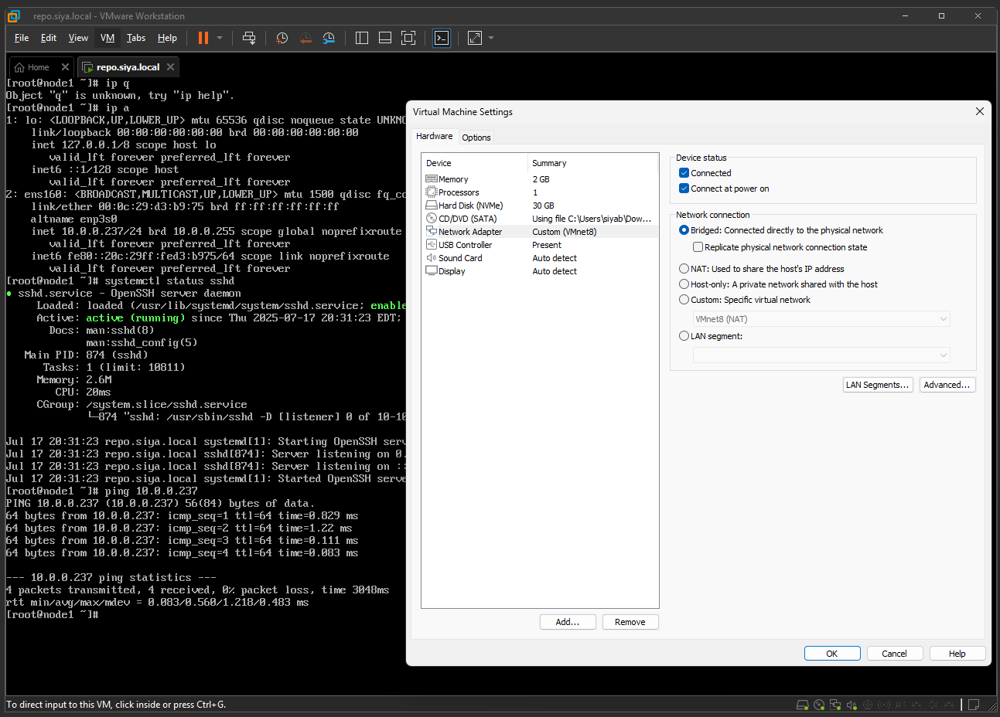
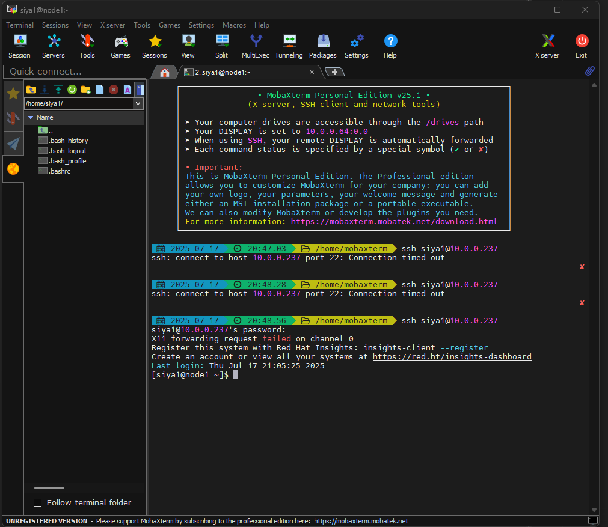

# VMware Home Lab 🧪

This repository documents my home lab built with **VMware vSphere**, **vCenter**, and **ESXi**.  
This lab helps me practice virtualization, networking, and system administration skills in a real-world environment.

---

## 🧱 Lab Environment

- 💻 Dell workstation running VMware ESXi
- 🎛️ vCenter Server Appliance (VCSA)
- 🖥️ Virtual Machines: RHEL 9, Windows Server, Ubuntu
- 📶 Networking configured with VLANs and virtual switches

---

## 📂 Folder Structure

## Solution:

Switched the VM’s network adapter to Bridged Mode.

